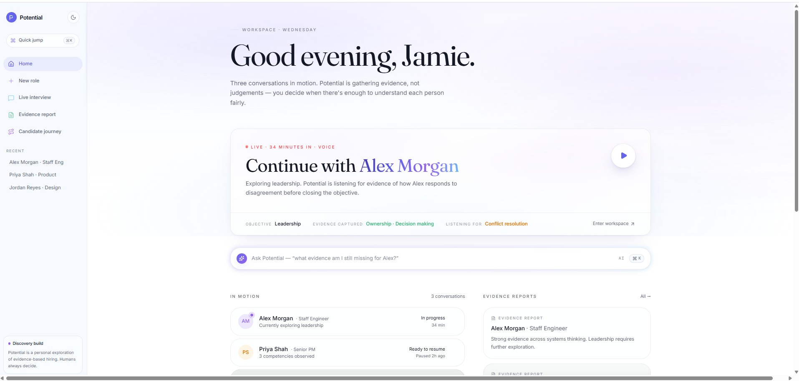
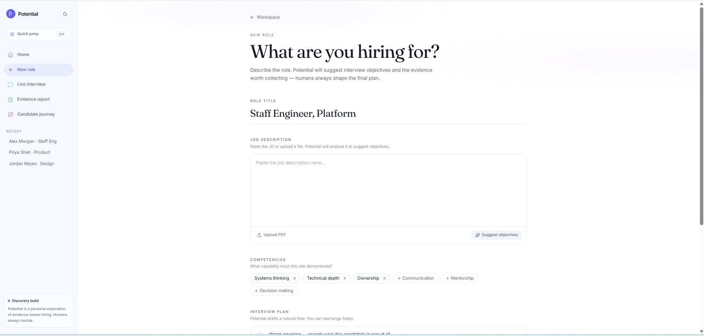
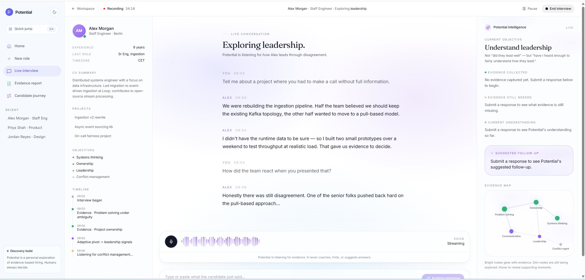
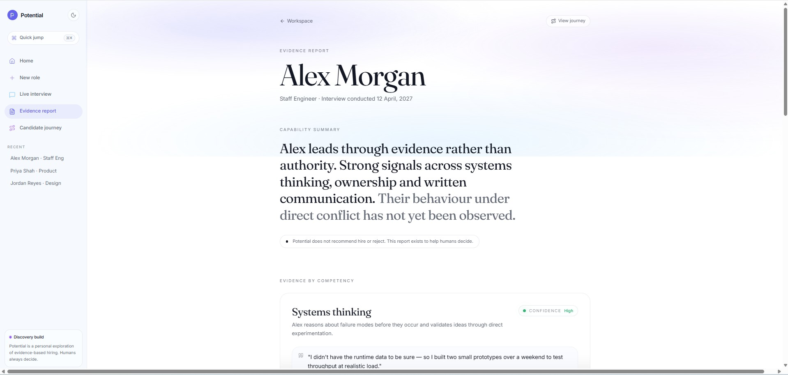
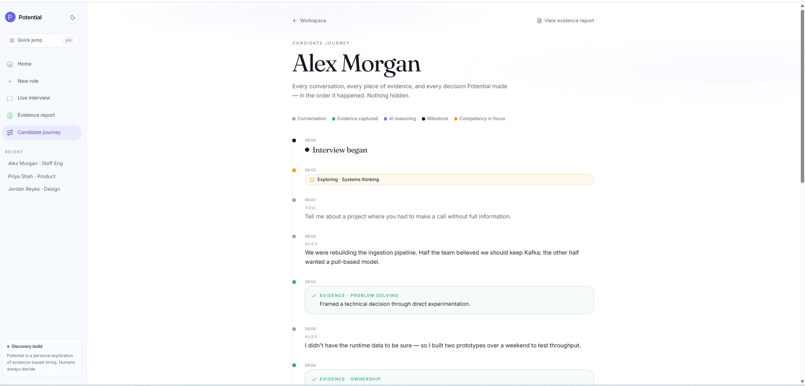

# Potential

> Evidence Intelligence for Fairer Hiring


**Potential helps interviewers and hiring teams collect trustworthy, explainable evidence about candidate capability — instead of a score, a rank, or an AI-generated recommendation.**

Humans still make every hiring decision. Potential's only job is to make sure they're deciding from real evidence, not an impression.

> **Have we collected enough trustworthy evidence to fairly understand this candidate?**

That's the only question the product optimizes for.

> 🚧 **Current status**
>
> Potential is transitioning from a working AI prototype into a production-ready platform. The core AI workflow — evidence extraction, gap analysis, and adaptive follow-ups — is complete and running against a live interview. Current work is focused on persistence, real interview data, and production architecture. See [Current Status](#current-status) for the detailed breakdown.

---



*The home workspace — where an interviewer's roles, interviews, and evidence reports come together.*

---

## What Potential is not

Potential is not:

- an AI interviewer
- an AI recruiter
- an ATS
- a candidate scoring platform
- a hiring recommendation engine

Potential exists to improve interview quality — not to automate hiring.

---

## Why Potential exists

Most interview tooling quietly answers the wrong question. It asks *"did this candidate perform well, right now, under pressure, in front of a stranger?"* — a question that rewards confidence and fluency with interview conventions as much as it rewards actual capability. Some tools go further and let an algorithm turn that impression into a score or a rank, which doesn't remove the bias — it just launders it through a number that looks objective.

Potential is built around a different question, and the architecture doesn't drift from it:

> Have we collected enough trustworthy evidence to fairly understand this candidate's capability?

That reframing has real consequences for what gets built. Evidence is inspectable — a hiring panel can read the exact quote, the exact reasoning, and judge for themselves whether it's convincing. A score is not inspectable; it's a conclusion with the reasoning removed. So the product's job is narrower than "help decide who to hire." Its job is to **notice what was actually said, notice what's still missing, and hand all of it back precisely** — never to stand in for the judgment of the person who was in the room.

The full reasoning behind this is written down, not just implied — see [`docs/manifesto.md`](docs/manifesto.md) and [`docs/interview-philosophy.md`](docs/interview-philosophy.md).

---

## Product principles

These aren't aspirational values — they're constraints the architecture is built to enforce, described in detail in [`docs/ai-charter.md`](docs/ai-charter.md) and [`docs/responsible-ai.md`](docs/responsible-ai.md).

**Potential always:**

| | |
|---|---|
| 🔍 | Helps interviewers collect trustworthy evidence |
| 🔁 | Adapts follow-up questions when evidence is missing |
| 🧾 | Explains every AI decision, with the quote and reasoning behind it |
| 📋 | Produces explainable, human-readable evidence reports |
| 🧑‍⚖️ | Keeps humans fully in control of the outcome |

**Potential never:**

| | |
|---|---|
| 🚫 | Scores candidates |
| 🚫 | Ranks candidates |
| 🚫 | Recommends a hire or reject decision |
| 🚫 | Compares one applicant against another |
| 🚫 | Predicts future performance |
| 🚫 | Coaches candidates or suggests answers |
| 🚫 | Replaces the recruiter or interviewer |

These are structural facts about the codebase, not settings someone could leave off by accident. There is no field for a score anywhere in the domain model. No engine produces a rank. No prompt asks a model to weigh in on fit.

---

## Product workflow

```
Role Planner
      ↓
Interview Blueprint
      ↓
Live Interview
      ↓
Evidence Extraction
      ↓
Evidence Gap Analysis
      ↓
Adaptive Follow-ups
      ↓
Reflection Check
      ↓
Evidence Report
      ↓
Candidate Journey
```

Each stage only sees the validated output of the one before it — gap analysis reasons over typed `Evidence`, never a raw transcript; follow-up generation reasons over that evidence and the gap analysis, never a transcript either. That isolation is deliberate: it keeps every stage auditable on its own terms and stops errors (or bias) from compounding as information moves downstream.

The engines from **Evidence Extraction** through **Reflection Check** are wired end-to-end today against a live interview session. **Evidence Report** and **Candidate Journey** exist as complete, polished UI, currently rendered with representative data while the persistence layer that will connect them to real interview history is built out — see [Current Status](#current-status).

---

## Product screenshots

**Role Planner** — turn a job description into a draft interview blueprint: competencies, objectives, and an evidence plan describing what to listen for. Never a question script, never a ranked list of what matters most.



**Live Interview Workspace** — a calm, evidence-first console for running an interview. Submit what the candidate said and watch evidence extraction, gap analysis, and follow-up suggestions happen alongside the conversation.



**Evidence Report** — the artifact a hiring panel actually reads: evidence organized by competency, each claim backed by an exact quote, gaps stated plainly instead of papered over. No score at the top. No verdict at the bottom.



**Candidate Journey** — the full, ordered trail of what happened: every response, every piece of evidence, every follow-up, and the reasoning behind it. Nothing hidden, nothing summarized away.



---

## AI architecture

The AI layer is isolated by design: it's the only part of the codebase that knows OpenAI exists, it never runs in the browser, and no UI component talks to it directly.

```
UI (component or route) → Service layer (server-only) → AI engine → OpenAI Responses API
```

Live Interview additionally holds its session state — transcript, evidence, in-progress analysis — in a Zustand store between calls. Role Planner has no session to track, so its route calls the service layer directly.

### Organized by capability, not by layer

```
src/ai/
  evidence/       Evidence Extraction Engine
  gaps/           Evidence Gap Analysis Engine
  followups/      Adaptive Follow-up Engine
  role-planner/   Role → Interview Blueprint Engine
  shared/         Cross-engine plumbing (see below)
```

Each engine follows the same shape — a system prompt, a per-call Zod schema, an orchestration function, and a named error type — so a new capability is a small, predictable addition rather than a bespoke integration:

```
{engine}/
  prompt.ts     System prompt + user-prompt builder
  schema.ts     Per-call Structured Output schema (Zod)
  client.ts     Thin OpenAI Responses API adapter
  {engine}.ts   Orchestration: validate → call → re-validate → return
  errors.ts     One named error type per engine
```

`shared/` holds the plumbing every engine needs and none of them should duplicate: one OpenAI Responses API adapter, one validate-or-throw helper, one base error class, and shared prompt/schema fragments (like rendering a list of collected evidence consistently everywhere it appears).

### What keeps the output honest

- **Structured Outputs + Zod, always.** Every model call is constrained to a schema, and the response is re-validated against that same schema before anything downstream is allowed to trust it. A malformed or invented response is treated as a failure, not silently accepted.
- **Competencies are grounded per call.** The set of competencies (and objectives) a model can reference is built fresh for every request, from the actual interview — not a static list. A model cannot invent a competency, and Zod's enum constraint makes this a structural guarantee, not a prompt request.
- **Cross-field consistency is enforced, not assumed.** Where an engine reports the same judgment two ways (for example, which competencies still need evidence, and the richer detail behind each one), a schema-level check rejects output where the two views disagree, rather than trusting the model to keep them in sync.
- **A refusal is an honest answer.** If a model declines to produce a usable result, that surfaces as "not enough evidence yet" — never a manufactured fallback dressed up to look confident.
- **Ports, not a hard dependency on OpenAI.** Every orchestration function depends on a small `parse(request)` interface, not the OpenAI SDK directly — so unit tests inject a fake client and never need a network call or an API key.

### Testing in two layers

- **Unit tests** run against a fake client with fixed responses — fast, deterministic, and they verify orchestration, validation, and error handling.
- **Evaluation tests** call the real OpenAI Responses API and verify the *model's actual behavior* against the product's hard rules — for example, that it never credits a capability the candidate didn't demonstrate, that a fully-covered competency is never reported as a gap, and that it never references a capability outside the ones supplied. These are skipped automatically without an API key and run deliberately, separate from the standard test suite.

There's also an internal-only route, `/playground/evidence`, for exercising an engine directly against the real API while iterating on prompts — no auth, no persistence, not part of the product.

---

## Tech stack

| Layer | Technology |
|---|---|
| **Frontend** | React 19 · TypeScript · TanStack Start (Router + Query) · Tailwind CSS v4 · shadcn/ui · Zustand |
| **AI** | OpenAI Responses API · Structured Outputs · Zod |
| **Testing** | Vitest (unit tests + gated evaluation tests) |
| **Deployment** | Cloudflare (via Nitro) |
| **Tooling** | Bun · ESLint · Prettier |

---

## Current status

**✅ Complete**

| Area | Detail |
|---|---|
| Evidence Extraction Engine | OpenAI Responses API, Structured Outputs, Zod-validated, unit + eval tested |
| Evidence Gap Analysis Engine | Missing/partial detection, grounded to the interview's own competencies |
| Adaptive Follow-up Engine | One grounded follow-up suggestion, never a list |
| Reflection Check | Pure, model-free check of whether collected evidence looks complete |
| Role Planner Engine | Job description → draft interview blueprint |
| Shared AI architecture | Common client, validation, error handling, and prompt utilities across all engines |
| Live Interview Workspace | Real-time evidence extraction, gap analysis, and follow-up suggestions against a live session |
| Evaluation test suite | Real-API tests proving grounding, no invented capabilities, no false gaps |

**🚧 In progress**

| Area | Detail |
|---|---|
| Evidence Report & Candidate Journey | UI complete; currently rendered with representative data ahead of the persistence layer |
| Role Planner → Live Interview handoff | A blueprint's competencies and objectives don't yet carry into the interview session that follows it |

**📅 Planned**

| Area | Detail |
|---|---|
| Persistence | Candidates, interviews, and evidence backed by a real database instead of in-memory state |
| Multi-candidate support | Running and resuming more than one interview |
| Multi-interview rollup | Aggregating evidence from several interviewers into one candidate record |
| Collaboration & enterprise readiness | Auth, workspaces, sharing, and the access model a team actually needs |

For how these planned items are sequenced, see [Roadmap](#roadmap) below.

---

## Roadmap

**Sprint 4**
- Persistence layer
- Database schema for Candidate, Interview, and Evidence
- Candidate model
- Interview model
- Evidence persisted per interview, not held only in memory

**Sprint 5**
- Candidate Journey backed by real, persisted interview data
- Evidence Reports backed by the same persistence layer
- Real interviews — replacing the current single representative session

**Sprint 6**
- Multi-interview support per candidate
- Human evidence review — editing or dismissing an AI-extracted item
- Evidence editing, with the correction itself kept as part of the record

**Phase 2**
- Authentication
- Workspaces
- Collaboration between interviewers and hiring managers
- Enterprise readiness: sharing, export, and access control

**Phase 3** *(exploratory)*
- ATS integrations, led by real design partners rather than built speculatively
- SSO, audit logging, and formal compliance groundwork

Roadmap items are sequenced deliberately: nothing in Sprint 5 or later is meaningful until persistence exists, so that comes first.

---

## Responsible AI

Potential's AI has exactly three jobs — extract evidence, analyze gaps, suggest one follow-up — and none of them is "decide." This isn't a policy layered on top; it's enforced at the architecture level:

- There is no field for a score anywhere in the domain model.
- No engine produces a rank or a comparison between candidates.
- No prompt asks a model to weigh in on fit, likelihood of success, or hiring recommendation.
- Gap analysis and follow-up generation never see a raw transcript — only structured, already-validated evidence from the stage before, so tone or phrasing can't sway a later judgment.

The full commitments — and where Potential's responsibility deliberately stops — are written out in [`docs/responsible-ai.md`](docs/responsible-ai.md). The short version: Potential doesn't claim to remove bias from hiring. It claims something narrower and more honest — that the evidence behind a hiring conversation is visible and checkable, instead of collapsed into an impression or a number.

---

## Learn more

Every principle above is a decision this repository has made deliberately, and each one is written down in full — not just asserted here:

| Document | What it covers |
|---|---|
| [`docs/north-star.md`](docs/north-star.md) | Why Potential exists, and what it will never become |
| [`docs/manifesto.md`](docs/manifesto.md) | The case for evidence over scores |
| [`docs/interview-philosophy.md`](docs/interview-philosophy.md) | What a good interview is actually for |
| [`docs/product-principles.md`](docs/product-principles.md) | The principles every feature decision is checked against |
| [`docs/ai-charter.md`](docs/ai-charter.md) | What the AI is for, and what it's never allowed to do |
| [`docs/responsible-ai.md`](docs/responsible-ai.md) | The risk being designed against, and where responsibility sits |
| [`docs/engineering-principles.md`](docs/engineering-principles.md) | How those principles translate into how we build |

---

## Getting started

Requires [Bun](https://bun.sh).

```bash
bun install
bun dev
```

The AI engines require an OpenAI API key. Create a `.env` file in the project root:

```bash
OPENAI_API_KEY=sk-...

# Optional — per-engine model overrides, all default to gpt-4o-mini
OPENAI_EVIDENCE_MODEL=gpt-4o-mini
OPENAI_GAP_ANALYSIS_MODEL=gpt-4o-mini
OPENAI_FOLLOWUP_MODEL=gpt-4o-mini
OPENAI_ROLE_PLANNER_MODEL=gpt-4o-mini
```

---

## Development

Run the unit test suite (fast, no API key required):

```bash
bun test
```

Run the evaluation suite for a specific engine against the real API (slower, requires `OPENAI_API_KEY`, non-deterministic by nature since it calls a live model):

```bash
OPENAI_API_KEY=sk-... npx vitest run noInference.eval
OPENAI_API_KEY=sk-... npx vitest run gapDetection.eval
```

Lint and format:

```bash
bun run lint
bun run format
```

Contributions are welcome — a bug fix, a UI refinement, or a discussion about where the persistence layer or multi-interview support should go next. Before proposing a new AI capability, it's worth reading [`docs/ai-charter.md`](docs/ai-charter.md): the standard for whether something belongs in Potential is simple — does it help an interviewer collect better evidence, or does it start making the decision for them. If it's the second, it doesn't ship, regardless of how capable the underlying model gets.

See [Learn more](#learn-more) for the full set of product philosophy documents.

---

## Project structure

```
src/
  ai/          AI engines, isolated from the UI — evidence extraction, gap analysis,
               adaptive follow-up, and role planning. Each organized by capability,
               with shared plumbing in ai/shared/. See "AI architecture" above.
  components/  Reusable UI: shadcn primitives and Potential's own components.
  domain/      The shared type model — candidates, evidence, interviews, reports.
               Framework-agnostic; every other layer imports from here.
  lib/         Utilities and mock fixtures used ahead of a real backend.
  routes/      Application pages and layouts (file-based routing).
  services/    The boundary between the UI and the AI layer. Wraps AI engines in
               server-only functions; nothing above this layer touches OpenAI.
  stores/      Client-side state (Zustand) — interview transcript, evidence, and
               in-progress analysis.

docs/          The product's philosophy, written down rather than left implicit —
               see "Learn more" above for what each document covers.
```

---

## License

MIT — see [`LICENSE`](LICENSE).
